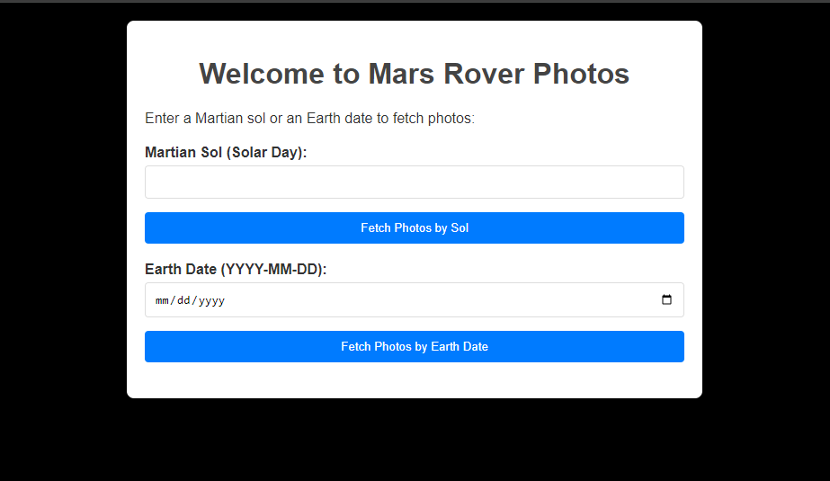
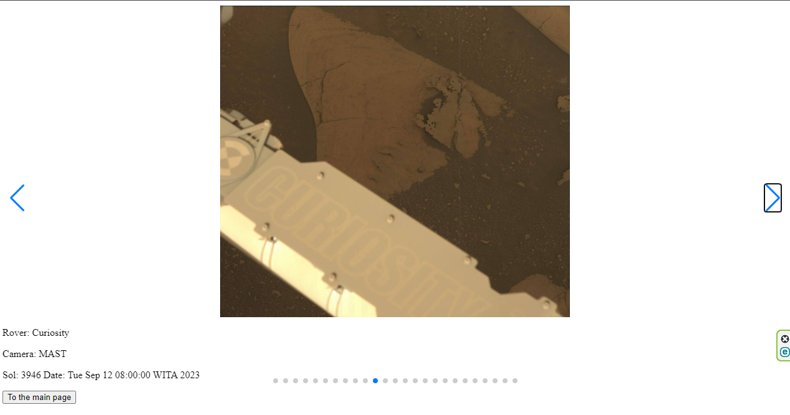

# Mars Rover Photos Application
The Mars Rover Photos application is a Spring Boot and Thymeleaf based web application that allows users to view photos taken by Mars Rovers. This application demonstrates the use of Kotlin for server-side development, integrating with the NASA API to fetch and display Mars Rover photos based on Sol (Martian solar day) or Earth date.

### Technology Stack
Backend: Kotlin with Spring Boot  
Frontend: Thymeleaf, CSS, JavaScript  
API: NASA Mars Rover Photos API  
Dependency Management: Maven

## Getting Started
### Prerequisites
JDK 17
Maven (for building and running the application)
### Running the Application  
Clone the repository to your local machine.  
Navigate to the project directory and build the project using Maven:  
```mvn clean package```
Run the application:  
```java -jar target/kotlin_test-0.0.1-SNAPSHOT.jar```

Open a web browser and go to http://localhost:8080 to view the application.  
### Application Structure
MarsRoverController  
The NasaController class handles HTTP requests. It provides endpoints for viewing the index page and fetching Mars Rover photos by either Sol or Earth date.  

### NasaService  
The NasaService class encapsulates the logic to communicate with the NASA API. It fetches Mars Rover photos based on the provided criteria.  

### Configuration  
API keys and other configurations are managed in application.properties. Ensure to set your NASA API key:  
```nasa.api.key=YOUR_NASA_API_KEY_HERE```
(I exposed mine, don't worry, it's free)  
### Frontend  
  

The frontend utilizes Thymeleaf templates to dynamically display Mars Rover photos. CSS is used for styling, and JavaScript enhances user interaction, such as displaying photos in a full-screen modal upon clicking.  

  

### Enhancement and Learning  
This project served as an opportunity to apply and enhance my Kotlin skills, focusing on:  

Writing idiomatic Kotlin code.  
Leveraging Kotlin's null safety features.  
Using Spring Boot annotations to simplify web application development.  
Integrating with external APIs using Spring's RestTemplate.  

# Conclusion
The Mars Rover Photos application showcases the use of Kotlin with Spring Boot for creating a simple, yet interactive web application. It demonstrates the power of Kotlin in backend development, integrating with APIs, and handling web requests effectively.

### Reference Documentation

For further reference, please consider the following sections:

* [Official Apache Maven documentation](https://maven.apache.org/guides/index.html)
* [Spring Boot Maven Plugin Reference Guide](https://docs.spring.io/spring-boot/docs/3.2.3-SNAPSHOT/maven-plugin/reference/html/)
* [Create an OCI image](https://docs.spring.io/spring-boot/docs/3.2.3-SNAPSHOT/maven-plugin/reference/html/#build-image)
* [Validation](https://docs.spring.io/spring-boot/docs/3.2.3-SNAPSHOT/reference/htmlsingle/index.html#io.validation)
* [Spring Web](https://docs.spring.io/spring-boot/docs/3.2.3-SNAPSHOT/reference/htmlsingle/index.html#web)
* [Thymeleaf](https://docs.spring.io/spring-boot/docs/3.2.3-SNAPSHOT/reference/htmlsingle/index.html#web.servlet.spring-mvc.template-engines)
* [Spring Boot Actuator](https://docs.spring.io/spring-boot/docs/3.2.3-SNAPSHOT/reference/htmlsingle/index.html#actuator)
* [Spring Data JPA](https://docs.spring.io/spring-boot/docs/3.2.3-SNAPSHOT/reference/htmlsingle/index.html#data.sql.jpa-and-spring-data)

### Guides

The following guides illustrate how to use some features concretely:

* [Validation](https://spring.io/guides/gs/validating-form-input/)
* [Building a RESTful Web Service](https://spring.io/guides/gs/rest-service/)
* [Serving Web Content with Spring MVC](https://spring.io/guides/gs/serving-web-content/)
* [Building REST services with Spring](https://spring.io/guides/tutorials/rest/)
* [Handling Form Submission](https://spring.io/guides/gs/handling-form-submission/)
* [Building a RESTful Web Service with Spring Boot Actuator](https://spring.io/guides/gs/actuator-service/)
* [Accessing Data with JPA](https://spring.io/guides/gs/accessing-data-jpa/)

